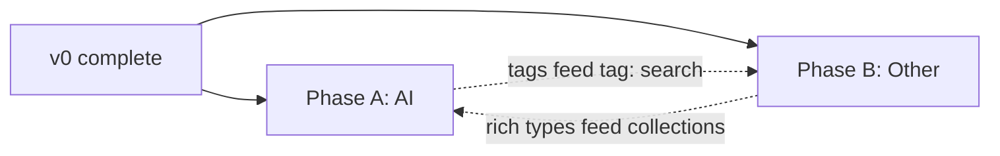

# ClipMind — Post-v0 Roadmap

**Status:** A1 complete · A2 ~95% (Groq provider pending) · A3/A4 not started  
**Date:** 20 June 2026  
**Baseline:** v0 complete (capture → FTS search → paste)  
**Vision source:** [AI Clipboard Plan.md](AI%20Clipboard%20Plan.md)

v0 delivers the core loop. Remaining work splits into **two phases** that can run in parallel after v0.

---

## Overview

| Phase | Name | Goal | Depends on |
|-------|------|------|------------|
| **A** | [AI](#phase-a--ai) | Local intelligence — search, metadata, actions, vision | v0 |
| **B** | [Other](#phase-b--other) | Organization, privacy, polish, shipping, growth | v0 |



**Suggested order:** start **A** and **B** in parallel. Within **A**, build search → metadata → actions → vision. Within **B**, build discovery → privacy → polish → growth.

**Ship target:** Phase **A** alone satisfies the plan’s AI MVP (*“Raycast-like clipboard with local semantic search”*). Phase **B** makes it trustworthy, shippable, and organized.

---

## Phase A — AI

**User promise:** ClipMind understands what you copied — find it in natural language, see smart titles and tags, transform it on demand, search inside screenshots.

### AI stack (locked — grilling 20 Jun 2026)

| Layer | Primary | Fallback | Offline |
|-------|---------|----------|---------|
| **Embeddings / search (A1)** | Apple NL | Ollama (optional) | FTS5 always |
| **Generative LLM (A2, A3)** | **Groq** (`llama-3.3-70b-versatile`) | Ollama localhost | Rules-only |
| **Vision OCR (A4)** | Apple `VNRecognizeTextRequest` | — | — |

- **API key:** Groq key in **macOS Keychain** only (never UserDefaults).
- **Sensitive clips:** **never** sent to cloud LLM — rules-only metadata; A3 actions disabled.
- **No background Ollama required** — app is fully usable with Apple embeddings + Groq (or rules-only if no key).
- **v1 = A1 + A2 + A3 + A4** all complete before Phase A ships.

### A1 — Semantic search (build first) ✅

- [x] `clipboard_embeddings` table (`item_id`, `model`, `vector`, `created_at`)
- [x] Vector search (in-process cosine; sqlite-vec deferred)
- [x] `EmbeddingGenerator` + `SemanticSearchService`
- [x] Embedding backends: **Apple NL** (default) + **Ollama** (`nomic-embed-text`)
- [x] Background queue on insert (skip tiny clips)
- [x] Hybrid search: FTS5 rank + vector similarity in `ClipboardRepository.search`
- [x] Palette/library use hybrid for natural-language queries (4+ words, no `type:`/`from:` prefixes)
- [x] Settings: Ollama URL, model name, enable/disable semantic search

**Exit:** *“react hydration bug missing props”* finds a stack trace FTS would miss.

### A2 — AI metadata 🚧

- [x] `summary` column migration; `tags` + `clipboard_tags` tables
- [x] Rules-first: LLM only for long/uncertain clips (≥200 chars)
- [x] Auto **title**, **summary**, **tags** on text clips
- [x] **Similar clips** in detail view (embedding cosine similarity)
- [x] UI: title, summary, tag chips on rows + detail; `tag:` search prefix
- [x] Async “indexing…” state on fresh clips
- [ ] `LLMProvider` abstraction: **Groq primary** → Ollama fallback → rules-only
- [ ] Groq API key in Keychain; Settings UI (model: `llama-3.3-70b-versatile`)
- [ ] Remove hard dependency on Ollama for metadata
- [ ] Manual exit test: 500-word clip gets title + summary in ~10s via Groq

**Exit:** 500-word clip gets title + summary in ~10s; top 5 similar clips shown.

### A3 — AI actions & smart paste

- `AIActionService` via same `LLMProvider` stack (Groq → Ollama → unavailable):
  - **v1 core 6:** Summarize · Shorter · Explain · Format JSON · Bullet points · Extract links
  - Post-v1: Professional · Extract tasks · Translate · email/tweet presets
- **Detail view only** (not palette) — user-initiated; result preview sheet before paste
- Smart paste variants: as summary · as bullets · plain · Markdown/JSON
- Sensitive clips: actions disabled (never sent to cloud)

**Exit:** JSON clip → Format JSON → valid paste; graceful fallback when no LLM available.

### A4 — Vision & image intelligence

- `VisionOCRService` (`VNRecognizeTextRequest`) on image insert + backfill
- **Auto on insert**; Settings toggle to disable OCR
- `ocr_text` on `clipboard_assets`; index in **FTS5 + semantic embeddings**
- Detail view shows extracted text under thumbnail

**Exit:** Screenshot with visible error text is searchable by those words.

### Schema (AI)

```sql
-- clipboard_embeddings
item_id TEXT PRIMARY KEY REFERENCES clipboard_items(id) ON DELETE CASCADE
model TEXT NOT NULL
vector BLOB NOT NULL
created_at REAL NOT NULL

-- clipboard_items (migration)
summary TEXT

-- tags
id TEXT PRIMARY KEY
name TEXT NOT NULL UNIQUE

-- clipboard_tags
clipboard_item_id TEXT REFERENCES clipboard_items(id) ON DELETE CASCADE
tag_id TEXT REFERENCES tags(id) ON DELETE CASCADE
PRIMARY KEY (clipboard_item_id, tag_id)

-- clipboard_assets (migration)
ocr_text TEXT
```

### Intelligence folder (target)

```
ClipMind/Intelligence/
  ContentClassifier.swift      (existing)
  SensitiveDetector.swift      (existing)
  EmbeddingGenerator.swift     (existing)
  SemanticSearchService.swift  (existing)
  AIMetadataService.swift      (existing)
  MetadataIndexer.swift        (existing)
  OllamaChatProvider.swift     (existing — fallback)
  GroqChatProvider.swift       (target)
  LLMProvider.swift            (target — Groq → Ollama → rules)
  AIActionService.swift
  VisionOCRService.swift
```

### Phase A — out of scope

- Cloud **embeddings** (Apple NL + optional Ollama only)
- Auto-running actions on every capture
- AI topic memory / auto-cleanup (see B4)
- Palette action menu (detail view only for v1)

---

## Phase B — Other

**User promise:** ClipMind is organized, private, polished, and shippable — without requiring AI to be useful.

### B1 — Discovery & organization

- Expand `ContentClassifier`: `error`, `prompt`, `command`, `json`, `markdown`, `email`
- Stack traces → `error` (not generic `code`)
- Date query parser: `today`, `yesterday`, `last:7d`, `last:30d`
- Smart collections (sidebar or chips):
  - Copied today / this week
  - From browser · From terminal
  - Coding errors · AI prompts · Recently used
- Library sidebar: **Prompts** and **Errors** filters
- `tag:` prefix (wired when Phase A tags ship)

**Exit:** `today error` returns only today’s errors; collections update live.

### B2 — Privacy & power controls

- Editable **app denylist** in Settings (seed from `CaptureDenylist`)
- Sensitive capture policy: save-but-hide (current) · block + warn · block silent
- Expand `SensitiveDetector`: credit cards, `xoxb-`, `.env` patterns, SSH markers
- **Lock app** (password / Touch ID for library + sensitive filter)
- **Incognito mode**: pause + auto-resume timer (5 / 15 / 30 min)
- Global pause shortcut + **shortcut rebinding** (palette, library)
- Optional auto-delete sensitive clips after N days

**Exit:** Block 1Password without editing source; lock hides sensitive content.

### B3 — Polish & distribution

- Palette opens **near cursor** (multi-monitor clamp) — currently screen-centered
- Native `.glassEffect()` on macOS 15+; `NSVisualEffectView` fallback if macOS 14 added
- Menu bar: **Open Command Palette** item
- Rich text paste toggle (RTF/HTML from metadata)
- Manual QA pass → document results in `manual-qa-results.md`
- Sparkle auto-updates · code signing · notarization · app icon
- Background queues for retention; performance pass

**Exit:** QA passes Safari/VS Code/Terminal/Finder; signed `.dmg` installs cleanly.

### B4 — Growth features (after A + B1–B3)

| Track | Features |
|-------|----------|
| **Collections** | Manual groups; drag clips in |
| **Prompt library** | Reusable prompt cards, variables, fill-and-copy |
| **Project memory** | Group by Xcode folder / git root |
| **Timeline replay** | Session view while debugging |
| **Developer mode** | Language detection, related clips (UI; AI explanations in Phase A) |

**Exit:** Manual collections + prompt library usable daily.

### Phase B — out of scope

- Cloud sync / iCloud
- Mac App Store sandbox (unless explicitly chosen later)
- Multiple-file clipboard special casing

---

## Milestones

| Release | Phases | Definition of done |
|---------|--------|-------------------|
| **v0** (done) | — | Capture, FTS, palette, library, images/files |
| **v1** | **A** complete | Semantic search + metadata + actions + OCR |
| **v1.1** | **B1 + B2** | Rich filters, privacy controls |
| **v1.2** | **B3** | Shippable Mac utility |
| **v2** | **B4** | Collections, prompts, project memory |

---

## Build tracks (quick reference)

**Phase A (AI)** — sequential inside the phase:

```
A1 Semantic search → A2 Metadata → A3 Actions → A4 Vision OCR
```

**Phase B (Other)** — mostly parallel tracks:

```
B1 Discovery ──┐
B2 Privacy   ──┼──► B3 Polish & ship ──► B4 Growth
               │
(A tags) ──────┘  (feeds tag: search in B1)
```

---

## Next steps

Break into vertical-slice issues when implementation starts:

**Phase A**
1. ~~Embedding schema + storage~~ ✅
2. ~~Apple/Ollama embedding provider + hybrid search~~ ✅
3. Groq `LLMProvider` + finish metadata pipeline
4. AI actions (detail view, core 6) + smart paste
5. Vision OCR + FTS + embedding indexing

**Phase B**
1. Classifier expansion + date parser + smart collections
2. Privacy settings + denylist UI + lock/incognito
3. UX polish + QA + distribution
4. Collections + prompt library
